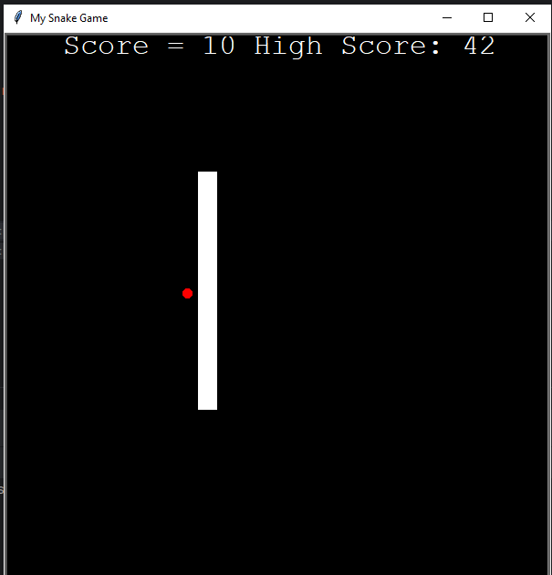

# Snake Game



This is a simple Snake game implemented in Python using the Turtle graphics library. The game replicates the classic Snake Xenzia game found on old Nokia phones. You control a snake that grows longer as it consumes food while avoiding collisions with itself and the game boundaries.

## How to Play

1. **Set Up the Game:**
   - Run the Python script `main.py`.
   - The game initializes with a snake and a piece of food.

2. **Controls:**
   - Use the arrow keys (Up, Down, Left, Right) to control the direction of the snake.
   - The snake will continuously move in the chosen direction until it hits a wall or collides with itself.

3. **Game Objective:**
   - The goal is to consume as much food as possible to grow the snake longer.
   - The game ends if the snake collides with itself or hits the wall.

4. **High Score:**
   - The game keeps track of the highest score achieved.
   - The high score is saved in a `data.txt` file.

5. **Restarting the Game:**
   - After the game ends, press 'Space' to restart and try to beat your high score.

## How to Run

Ensure you have Python installed on your machine. Open a terminal and run the following command:

```bash
python main.py
```

## Game Features
The game uses the Turtle graphics library for a simple and interactive display.
The snake grows longer each time it consumes food.
The game keeps track of the player's score and displays it on the screen.
High scores are saved in a highscore.txt file.
Customize and Contribute
Feel free to modify the game or add new features to enhance the gaming experience. You can customize the code in main.py to suit your preferences or contribute to the project.
